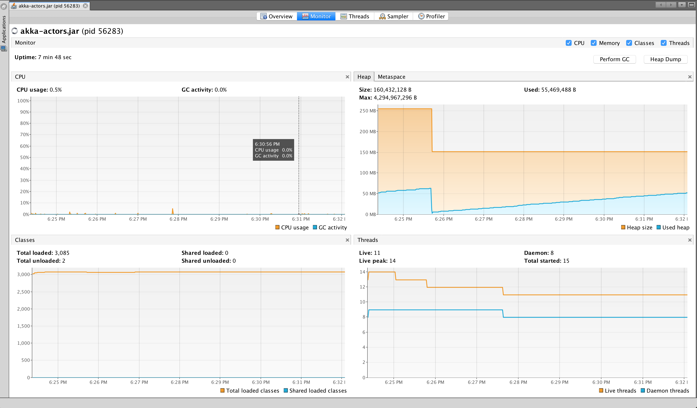

actors performance
------------------

```
sbt assembly
```

```
$ java -jar target/scala-2.12/akka-actors-perf.jar
[DEBUG] [03/23/2018 18:24:17.839] [main] [EventStream(akka://nlu-actor-system)] logger log1-Logging$DefaultLogger started
[DEBUG] [03/23/2018 18:24:17.840] [main] [EventStream(akka://nlu-actor-system)] Default Loggers started
received What is the weather in Seattle?
responding intent
```

1)


2)

